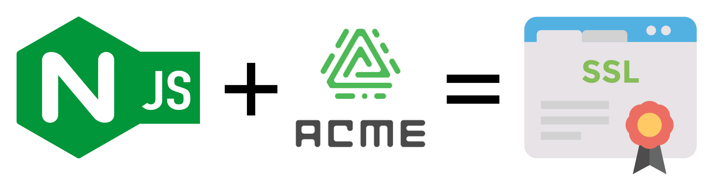

[](https://github.com/nginx/njs-acme/actions/workflows/ci.yaml)
[](https://www.repostatus.org/#concept)
[](https://github.com/nginx/njs-acme/discussions)



# njs-acme

This repository provides a JavaScript library to work with [ACME](https://datatracker.ietf.org/doc/html/rfc8555) providers such as Let's Encrypt for [NJS](https://nginx.org/en/docs/njs/). The source code is compatible with the `ngx_http_js_module` runtime. This allows for the automatic generation and renewal of TLS/SSL certificates for NGINX.

Requires at least `njs-0.8.2`, which is included with NGINX since `nginx-1.25.3`.

NOTE: Some ACME providers have strict rate limits. Please consult with your provider. For Let's Encrypt refer to their [rate-limits documentation](https://letsencrypt.org/docs/rate-limits/).

## Installation

There are a few ways of using this repo. You can:
* build an ACME-enabled docker image to replace your existing NGINX image
* use Docker to build the `acme.js` file to use with your NGINX installation
* build `acme.js` using a locally installed Node.js toolkit to use with your NGINX installation

Each option above is detailed in each section below.

### Creating a Docker Image
To create an Nginx+NJS+njs-acme docker image, simply run:
```
% make docker-build
...
 => exporting to image
 => => exporting layers
 => => writing image ...
 => => naming to docker.io/nginx/nginx-njs-acme
```
This will build an image with a recent version of NGINX, required njs version, and the `acme.js` file installed at `/usr/lib/nginx/njs_modules/`.

The image will be tagged `nginx/nginx-njs-acme`, where you can use it in place of a standard `nginx` image.

### Building `acme.js` With Docker

If you want to use your own NGINX installation and do not want to have to worry about installing Node.js and other build dependencies, then you can run this command:
```
make docker-copy
```

This will build the full image and copy the `acme.js` file to the local `dist/` directory. You can then include this file in your NGINX deployments.

### Building `acme.js` Without Docker

If you have Node.js and NPM installed on your computer, you can run this command to generate `acme.js` directly:
```
npm ci
make build
```

This will generate `dist/acme.js`, where you can then integrate it into your existing NGINX / NJS environment.

## Configuration Variables

You can use environment variables _or_ NGINX `js_var` directives to control the behavior of the NJS ACME client.

In the case where both are defined, environment variables take precedence. Environment variables are in `ALL_CAPS`, whereas the nginx config variable is the same name, just prefixed with a dollar sign and `$lower_case`.

For example, `NJS_ACME_SERVER_NAMES` (env var) is the same as `$njs_acme_server_names` (js_var).

### Required Variables

   - `NJS_ACME_ACCOUNT_EMAIL` (env)\
     `$njs_acme_account_email` (js_var)\
        Your email address to send to the ACME provider.\
        value: Any valid email address\
        default: none (you must specify this!)

   - `NJS_ACME_SERVER_NAMES` (env)\
     `$njs_acme_server_names` (js_var)\
        The hostname or list of hostnames to request the certificate for.\
        value: Space-separated list of hostnames, e.g. `www1.mydomain.com www2.mydomain.com`\
        default: none (you must specify this!)

### Optional Variables
   - `NJS_ACME_VERIFY_PROVIDER_HTTPS` (env)\
     `$njs_acme_verify_provider_https` (js_var)\
        Verify the ACME provider certificate when connecting.\
        value: `false` | `true`\
        default: `true`

   - `NJS_ACME_DIRECTORY_URI` (env)\
     `$njs_acme_directory_uri` (js_var)\
        ACME directory URL.\
        value: Any valid URL\
        default: `https://acme-staging-v02.api.letsencrypt.org/directory`

   - `NJS_ACME_DIR` (env)\
     `$njs_acme_dir` (js_var)\
        Path to store ACME-related files such as keys, certificate requests, certificates, etc.\
        value: Any valid system path writable by the `nginx` user. \
        default: `/etc/nginx/njs-acme/`

   - `NJS_ACME_CHALLENGE_DIR` (env)\
     `$njs_acme_challenge_dir` (js_var)\
        Path to store ACME-related challenge responses.\
        value: Any valid system path writable by the `nginx` user. \
        default: `${NJS_ACME_DIR}/challenge/`

   - `NJS_ACME_ACCOUNT_PRIVATE_JWK` (env)\
     `$njs_acme_account_private_jwk` (js_var)\
        Path to fetch/store the account private JWK.\
        value: Path to the private JWK\
        default: `${NJS_ACME_DIR}/account_private_key.json`

   - `NJS_ACME_SHARED_DICT_ZONE_NAME` (env)\
     `$njs_acme_shared_dict_zone_name` (js_var)\
        [Shared Dictionary Zone](https://nginx.org/en/docs/http/ngx_http_js_module.html#js_shared_dict_zone) name .\
        value: Zone name used as in `js_shared_dict_zone` directive\
        default: `acme`

## NGINX Configuration

There are a few pieces that are required to be present in your `nginx.conf` file. The file at [`examples/nginx.conf`](./examples/nginx.conf) shows them all.

NOTE: The examples here use `js_var` for configuration variables, but keep in mind you can use the equivalent environment variables instead if that works better in your environment. See the Configuration Variables section above for specifics.

### `nginx.conf` Root
* Ensures the NJS module is loaded.
   ```nginx
  load_module modules/ngx_http_js_module.so;
  ```

### `http` Section
* Adds the NJS module directory to the search path.
  ```nginx
  js_path "/usr/lib/nginx/njs_modules/";
  ```
* Ensures a root certificate bundle is loaded into NJS.
  ```nginx
  js_fetch_trusted_certificate /etc/ssl/certs/ISRG_Root_X1.pem;
  ```
* Load `acme.js` into the `acme` namespace.
  ```nginx
  js_import acme from acme.js;
  ```
* Configure a DNS resolver for NJS to use.
  ```nginx
  resolver 127.0.0.11 ipv6=off; # docker-compose
  ```
* Configure a [Shared Dictionary Zone](https://nginx.org/en/docs/http/ngx_http_js_module.html#js_shared_dict_zone) to use.\
  Set zone size to be enough to store all certs and keys. e.g. 1MB should be enough to store 100 certs/keys
  ```nginx
  js_shared_dict_zone zone=acme:1m
  ```
  * NOTE: If you want to use a different `js_shared_dict_zone` name, then you need to define the variable `$njs_acme_shared_dict_zone_name` with the name you would like to use. You can also use the environment variable `NJS_ACME_SHARED_DICT_ZONE_NAME`.
    ```nginx
    js_var $njs_acme_shared_dict_zone_name acme;
    ```

### `server` Section(s)
* Set your email address to use to configure your ACME account. This may also
be defined with the environment variable `NJS_ACME_ACCOUNT_EMAIL`.
  ```nginx
  js_var $njs_acme_account_email test@example.com;
  ```
* Set the hostname or hostnames (space-separated) to generate the certificate.
This may also be defined with the environment variable `NJS_ACME_SERVER_NAMES`.
  ```nginx
  js_var $njs_acme_server_names 'proxy.nginx.com proxy2.nginx.com';
  ```
* Set and use variables to hold the certificate and key paths using Javascript.
  ```nginx
  js_set $dynamic_ssl_cert acme.js_cert;
  js_set $dynamic_ssl_key acme.js_key;

  ssl_certificate data:$dynamic_ssl_cert;
  ssl_certificate_key data:$dynamic_ssl_key;
  ```

### `location` Blocks
* Location to handle ACME challenge requests. This must be accessible from the ACME server - in most cases this means accessbile from another host on the Internet if you are using a service like Let's Encrypt.
  ```nginx
  location ~ "^/\.well-known/acme-challenge/[-_A-Za-z0-9]{22,128}$" {
    js_content acme.challengeResponse;
  }
  ```
* Named location to contain the `js_periodic` directive to automatically
request or renew certificates if necessary.
  ```nginx
  location @acmePeriodicAuto {
    js_periodic acme.clientAutoMode interval=1m;
  }
  ```

## Development

This project uses Babel and Rollup to compile TypeScript sources into a single JavaScript file for `njs`. It uses Mocha with nginx-testing for running integration tests against the NGINX server. This project uses [njs-typescript-starter](https://github.com/jirutka/njs-typescript-starter/tree/master) to write NJS modules and integration tests in TypeScript.

The ACME RESTful client is implemented using [ngx.fetch](http://nginx.org/en/docs/njs/reference.html#ngx_fetch), [crypto API](http://nginx.org/en/docs/njs/reference.html#builtin_crypto), [PKI.js](https://pkijs.org/) APIs in the NJS runtime.

### With Docker

There is a `docker-compose.yml` file in the project root directory that brings up an ACME server, a challenge server, a Node.js container for rebuilding the `acme.js` file when source files change, and an NGINX container. The built `acme.js` file is shared between the Node.js and NGINX containers. The NGINX container will reload when the `acme.js` file changes.

To start up the development environment with docker compose, run the following:

    make docker-devup

If you use VSCode or another devcontainer-compatible editor, then run the following:

    code .

Choose to "Reopen in container" and the services specified in the `docker-compose.yml` file will start. Editing and saving source files will trigger a rebuild of the `acme.js` file, and NGINX will reload its configuration.

### Without Docker

To follow these steps, you will need to have Node.js version 14.15 or greater installed on your system.

1. Install dependencies:

        npm ci

2. Start the watcher:

        npm run watch

3. Edit the source files. When you save a change, the watcher will rebuild `./dist/acme.js` or display errors.


## Testing

### With Docker

1. Start a test environment in Docker:

        make docker-devup

2. Optionally you can watch for `nginx` log file in a separate shell:

        docker compose logs -f nginx

3. When started initially, nginx will not have certificates at all. If you use the [example config](examples/nginx.conf), you will need to wait one minute for the `js_periodic` directive to invoke `acme.clientAutoMode` to create the certificate.

4. Send an HTTP request to nginx running in Docker:

        curl -vik --resolve proxy.nginx.com:8000:127.0.0.1 http://proxy.nginx.com:8000/

5. Send an HTTPS request to nginx running in Docker to test a new certificate:

        curl -vik --resolve proxy.nginx.com:4443:127.0.0.1 https://proxy.nginx.com:4443

6. Test with `openssl`:

        openssl s_client -servername proxy.nginx.com -connect localhost:4443 -showcerts

7. Display content of certificates

        docker compose exec -it nginx ls -la /etc/nginx/njs-acme/

The [docker-compose](./docker-compose.yml) file uses volumes to persist artifacts (account keys, certificate, keys). Additionally, [letsencrypt/pebble](https://github.com/letsencrypt/pebble) is used for testing in Docker, so you don't need to open up port 80 for challenge validation.


## Build Your Own Flows

If the reference implementation does not meet your needs, then you can build your own flows using this project as a library of convenience functions.

Look at `clientAutoMode` in [`src/index.ts`](./src/index.ts) to see how you can use the convenience functions to build a ACME client implementation.

## Project Structure

|                       Path              | Description |
| ----                                    | ------------|
| [src](src)                              | Contains your source code that will be compiled to the `dist/` directory. |
| [integration-tests](integration-tests)  | Integration tests. |
| [unit-tests](unit-tests)                | Unit tests for code in `src/`. |

## Contributing

Please see the [contributing guide](https://github.com/nginx/njs-acme/blob/main/CONTRIBUTING.md) for guidelines on how to best contribute to this project.

## License

[Apache License, Version 2.0](https://github.com/nginx/njs-acme/blob/main/LICENSE)

&copy; [F5, Inc.](https://www.f5.com/) 2023
